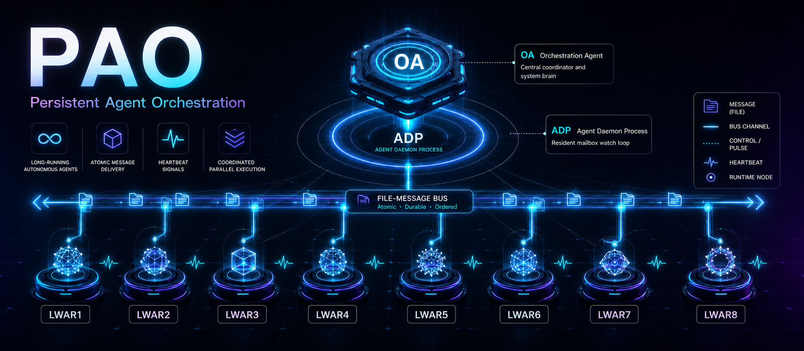

# PAO

**Persistent Agent Orchestration** is a local orchestration system that coordinates heterogeneous long-running AI runtimes behind a single external identity model, `LWARn`, over a file-based message bus.

PAO does not force vendor CLIs into non-interactive execution. Each runtime session is started by the user, then repeatedly calls an **ADP (Agent Daemon Process)** watcher to receive work and return results inside the same conversational context.

## Architecture

```text
OA (Orchestration Agent)
  └─ Task JSON → mailbox/LWARn/incoming/
                         ↓ atomic claim
              LWAR long-running session
                         ↓ ADP watch/execute loop
  └─ Result JSON ← mailbox/LWARn/outgoing/
```

- **OA**: approves registrations, publishes tasks and controls, collects results, and recovers expired leases
- **LWAR**: stable execution identity that hides provider and model names (`LWAR1`, `LWAR2`, ...)
- **ADP**: resident mailbox loop built from 5-second polling and 90-second watch slices
- **File bus**: atomic JSON publish/claim flow with heartbeat, generation, and lease semantics

## Key Properties

- `/lwar-register [number]` self-registration with optional automatic lowest-number allocation
- stale-message isolation by `lwar_id + instance_id + generation`
- atomic bounded LWAR startup: `response --resident` adopts identity and enters
  the watcher in one Python process; OA distinguishes registered-not-started
  from active-then-stale, and auto-routing waits for the first operational
  heartbeat
- explicit startup-failure recovery: OA reclaims an overdue `starting` slot
  only with its exact identity tuple and only when no active mailbox work exists
- tombstone-first startup-reap commit with retry convergence after a process
  crash between the tombstone and registry writes
- post-commit startup-reap replay that preserves state bytes and registry
  version while restoring a response and audit trail
- deterministic audit idempotency across active, rotated, and degraded logs for
  crash-safe startup-reap event recovery
- lock-serialized degraded audit spooling that retains one pending record per
  deterministic key across repeated active-log failures
- crash-consistent degraded promotion that filters keys already committed to
  active or rotated logs after a post-flush process stop
- `fsync` durability barriers for active and degraded audit appends before
  reporting durability or deleting the recovery spool
- lock-serialized, spool-aware audit pruning that retains rotated idempotency
  evidence until pending degraded replay has converged
- fail-closed deterministic key scans that defer append when any active or
  rotated audit segment is unreadable
- strict audit JSONL validation with durable quarantine and bounded repair of
  only crash-truncated mutable tails
- read-only `oa audit-health` diagnostics for blocked replay, malformed
  segments, pending degraded records, and quarantine evidence
- fingerprint-fenced `oa audit-repair` that removes exactly the diagnosed
  malformed lines, durably preserves original evidence, and uses a durable
  receipt to resume replacement/audit commit exactly once after process stops
- lifecycle transitions: `on → draining → off → deregistered`
- support for long-running runtimes, including TUIs
- provider-neutral task and result contracts
- lease recovery plus generation bumps when aliases are reused
- retry budget enforcement with a dead-letter queue (`dead/`, `oa_cli dead --requeue`)
- stale and duplicate result quarantine at collection time
- claim leases aligned with each task's `timeout_s`
- durable OA task ledger (`var/tasks/`) with `validate` and `workflow-status` commands
- capability- and load-based automatic routing (`send --auto --require-capability`)
- `depends_on` task gating for simple workflow DAGs
- append-only audit log (`var/audit/events.jsonl`) and fail-closed archive and
  committed-repair-evidence pruning (`prune`)
- durable `.repair-prune/` transactions that converge receipt and backup
  cleanup after a process stop at any deletion boundary
- read-only `audit-health` classification of retention transactions as
  `resumable` or reason-coded `blocked`
- rotated-audit retention fences that preserve tombstone targets and key
  carriers and cancel pruning when tombstone keys are unreadable
- pre-delete JSON-object JSONL validation with separate rotated
  removed/protected/blocked prune counts and reason-coded per-segment outcomes
- fingerprint-bound `.rotated-prune/` receipts that resume partial segment
  deletion and recover the deterministic `pruned` event after process stops
- read-only `audit-health` classification of rotated-prune receipts as
  `resumable` or stable reason-coded `blocked`
- fingerprint-fenced `audit-prune-resolve` with durable
  `.rotated-preserve/` markers for operator-preserved recreated segments
- read-only `.rotated-preserve/` health classification for valid protection,
  orphaned markers, duplicate target claims, target drift, and missing audit
  bindings
- fingerprint-fenced `audit-preserve-release` with event-before-unlink
  convergence that removes only the marker and leaves the segment intact
- read-only release-event health classification for completed, event-first
  resumable, duplicate, payload-conflicting, and marker-drift topologies
- command-wide OA mutation serialization, including concurrent processes that
  reuse the same `PAO_OA_ID`
- cross-platform stale-lock recovery that preserves live holders and reclaims
  command locks left by terminated OA processes
- replaceable message plane: the `Transport` protocol with `FileTransport` as the local implementation
- distributed as two self-contained skills (`.agents/skills/pao-oa`, `.agents/skills/pao-lwar`): each bundles the contract, wrapper scripts, and the full stdlib-only runtime; installs by folder copy alone (no pip, no plugin). Vendor-neutral — proven on Claude Code and Kimi Code CLI

## Installation and Deployment Modes

PAO is distributed as two **self-contained skills** — `.agents/skills/pao-oa` and
`.agents/skills/pao-lwar`. Each bundles the OA/LWAR contract, the wrapper scripts,
and the full stdlib-only runtime (plus message schemas for the LWAR). There is
**one channel**; installation is a folder copy — no pip, no plugin.

### Install (folder copy)

Copy the two skill folders into whichever global skills path your runtime loads
— `~/.claude/skills` for Claude Code, `~/.agents/skills` (the emerging
cross-runtime convention), or any location you prefer:

```bash
cp -r .agents/skills/pao-oa .agents/skills/pao-lwar ~/.claude/skills/
```

Invocation is namespace-free: `/pao-oa`, `/pao-lwar`. In a shell, call the
wrapper scripts by their absolute path (they bootstrap their own import path, so
no install is needed): `python "<skill>/scripts/oa.py" …`,
`python "<skill>/scripts/lwar.py" …`.

### Bus root

Root resolution precedence: explicit `--root` > `PAO_ROOT` environment variable
> a **`.pao/` folder under the current directory** (the default). The `.pao/`
default keeps all PAO state (`mailbox/`, `var/`, `control/`) in one hidden,
gitignorable folder instead of scattering it across the project workspace. Set
`PAO_ROOT` to a central bus shared across projects instead. Each task executes in
its own `cwd` — any project workspace can host an OA or LWAR session.

### Canonical source

`.agents/skills/pao-lwar` is the **runtime master**; edit `pao_runtime/`, `scripts/`,
or `schemas/` only there, then run `python tools/sync_bundles.py` to mirror
into `pao-oa`. The test suite byte-verifies the two bundles match. `pao info`
diagnoses version and root resolution; `pao doctor --role oa|lwar` is a
pre-flight check.
On Windows, the sync tool falls back to atomic replacement of hash-different
generated files when an open runtime prevents renaming the whole skill root.

## Quick Start

Start the two agent runtimes in the same project directory, or give both the same
`PAO_ROOT`. Each runtime needs only its role skill; the skill owns bootstrap and
all later commands.

### 1. Start OA

```text
Read <absolute-path>/pao-oa/SKILL.md and act as the PAO OA.
```

### 2. Start LWAR

```text
Read <absolute-path>/pao-lwar/SKILL.md and act as a PAO LWAR.
```

No registration prompt, ADP prompt, or copied command sequence is required. The
two `SKILL.md` files and their bundled references are the sole operating contract.

## Documentation

- [Technical specification](docs/PAO_TechSpec.md)
- [ADP operations guide](docs/PAO_ADP_Operations.md)
- [Skill-only bootstrap note](docs/LWAR_ADP_Bootstrap.md)

## Verification

```bash
python -m unittest discover -s tests -v
python -m py_compile .agents/skills/pao-lwar/pao_runtime/*.py .agents/skills/pao-lwar/scripts/*.py tests/*.py
```

GitHub Actions runs Python compilation, the full test suite, and the bundle
byte-sync gate on both Ubuntu and Windows for pushes to `main` and pull
requests.

The integration suite verifies registration, collision rejection, bounded startup classification, identity-fenced startup-slot recovery, active-work preservation, tombstone-first and post-commit crash convergence, audit-step idempotency, repeated-outage degraded-spool deduplication, post-flush process-crash recovery, active-`fsync` failure recovery, spool-aware prune/replay serialization, unreadable-segment fail-closed recovery, malformed JSONL detection and truncated-tail quarantine, read-only audit-health diagnostics, fingerprint-fenced audit repair, receipt-driven crash-boundary convergence, committed-only repair-evidence retention, hard-crash retention-tombstone convergence, read-only resumable/blocked topology classification, rotated target/key-carrier retention fencing, pre-delete rotated JSONL validation and outcome accounting, ambiguous-evidence preservation, and exact-once replay dogfooding, concurrent `send`/reap serialization, live-lock preservation and killed-holder recovery, current-generation heartbeat fencing, full task/result flow, resident idle heartbeat continuity, compatibility idle-timeout behavior, off-state rejection, stale lease recovery, shutdown and clean-retire control, OA presence classification, generation increments, retry budget and dead-letter transitions, stale/duplicate result quarantine, lease alignment, ledger lifecycle, heartbeat staleness, validation reporting, capability/load routing, cancel and priority flows, tombstone windows, pruning, audit logging, `depends_on` gating, attempt fencing, artifact provenance, authority bounds, single-writer OA lease, the `.pao/` default root and portability, the graded-correctness axis, and the two-bundle byte sync.

Preservation-release verification includes real subprocess `os._exit` crashes
at both event-append-to-marker-unlink and marker-unlink-to-CLI-response
boundaries, followed by read-only health discovery, dead-holder lock recovery,
and exact-once CLI completion.

## License

This project is licensed under the MIT License. See [LICENSE](LICENSE).
